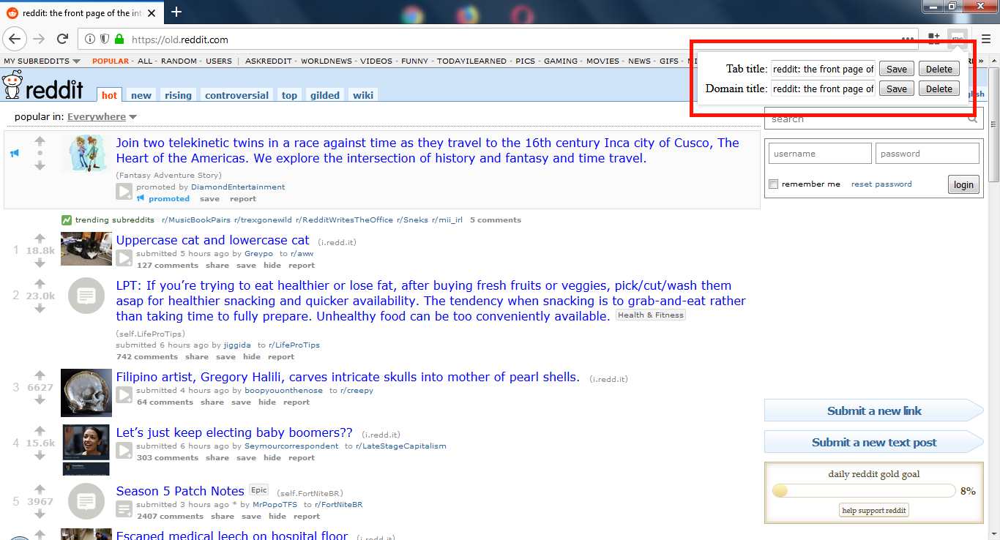

## Rename Tab Title of Domain/URL

Inspired by: [Rename Tab Title](https://addons.mozilla.org/en-US/firefox/addon/rename-tab-title/)

With the above, you are able to change the title of the Firefox window of any URL you visit. \
However, you will have to set it to for every page in that site individually, if you want all of them to be changed. \

With this Firefox extension, you are able to change the title of all pages of a site in one go, or each individually (if you so desire).

If both of them are set, a "Tab title" is given higher preference over "Domain title".

You can delete any title which is set using the "Delete" button next to it.
If "Tab title" is deleted, the "Domain title" will be honored (if it is set).

By default, in the textboxes, the current title is populated.